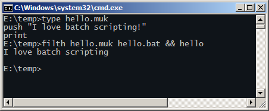

# Batchfilth
*Combining the robustness of Batch scripts with the expressibility of assembly language.*



**Batchfilth** is a simple virtual stack machine interpreter written in Microsoft batch scripting language.

## Features
* **Compatible** - compiles to standalone `.bat` files
* **Scientific** - built-in 22.10 fixed-point support
* **Powerful** - goto command
* **Fun** - Reverse Polish notation, kind of

## Example

Below is source code for a Body Mass Index calculator.

```perl
# Simple BMI calculator
push "Quetelet index calculator"
print
push "Enter yer mass in kg: "
input
string_to_fixed
push "Enter yer height in metres: "
input
string_to_fixed

# Square the height. This is slightly incorrect but easy.
dup
fmul
fdiv

fixed_to_string
push "Your BMI is"
print
print
```

Which outputs

    Quetelet index calculator         
    Enter yer mass in kg: 85.2        
    Enter yer height in metres: 1.82  
    Your BMI is                       
    25.68750                          

See `babylon.muk` for a more elaborate example.

## Usage
The compiler reads a `.muk` script and outputs a batch file.
For example to compile `input.muk` to `output.bat` type:

    filth input.muk output.bat

Windows XP or later is required. This could be made MS-DOS compatible with some effort, which would actually be really great.

### How it works
Commands are turned into simple batch subroutine calls.

```
push 5
print
```

Will turn into the following.

```batch
call :push 5
call :print
```

In practice the whole compiler code is concatenated to the generated script, and some headers are added. 
The compiler code contains the virtual machine implementation, which is also used during compilation.

The reason for this is that it's apparently impossible to read lines in a batch script without evaluating them. This makes it pretty hard to extract only the parts relevant to the runtime from `filth.bat`, since every line read is mutilated by the `cmd.exe` parser before they are saved to a variable.

Another point of view is that this enforces a kind of a viral license - all compiled scripts automatically contain the compiler code that was used to create them. That's kind of cool!

The runtime could be a separate file that would get appended to the generated script code, but this would make the system less elegant. It's fun to have the compiler as a single file.

## Description
There's a single stack that holds strings. The strings can be interpreted as 32-bit signed integers or 22.10 signed [fixed-point](https://en.wikipedia.org/wiki/Fixed-point_arithmetic) values. All operations are done with this stack.

### Language reference

* Commented lines begin with `#`.
* Batch script lines begin with a `$`.
* No extra whitespace is allowed anywhere.
* If memory is read before writing an error message is generated.

Each command should be on its separate line.

In the examples stack grows from left to right, so for example in notation 

    a b

`a` was pushed before `b`. So `b` is at the top.
The operations are done on the value on top of the stack if nothing else is specified.

#### push [value]
Pushes `value` to stack.
#### pop
Pops a value from stack.

#### dup
Duplicates the top value.

    a b --> a b b

#### swap
Swaps the places of two values on the top of the stack.

    a b c --> a c b

#### over
Duplicates the second value on the stack.

    a b c --> a b c b

#### rot
Rotates the stack so the third values goes on top.

    a b c --> b c a


#### print
Prints a value and removes it from stack.

#### peep
Prints a value but doesn't remove it.

#### test [operation]
Pops two values from stack and compares them. 
`operation` should be one of the batch script comparison operators

    EQU : Equal
    NEQ : Not equal
    LSS : Less than <
    LEQ : Less than or Equal <=
    GTR : Greater than >
    GEQ : Greater than or equal >=

1 is pushed to the stack if comparsion was true, otherwise 0.

#### if [label]
Jumps to `label` if the value on top of the stack is 1. Use together with `test`.

#### go [label]
Jumps to a row marked with `label`. Label lines are marked with the `:label` notation.

Example:

    go skip 
    push "not shown"
    print
    :skip

#### do - loop
Repeats the section between `do` and `loop` until the integer on top of stack is zero.

Example:

    # Repeat ten times
    push 10
    do
        dec
    loop

The `loop` command automatically pops the counter value off the stack when the loop is complete.

#### input
Prompts a value from the user and pushes it on stack. The prompt text is popped from the stack.

Example:

    push "Enter value:"
    input

#### fixed [value]
Pushes a fixed point value to stack. `value` should be a decimal number, e.g. `2.4`.

#### fixed_to_string
Converts a fixed point value to string.

#### string_to_fixed
Converts a string to a fixed-point value. (Please use this often as it was arduous to implement!)

#### to_int
Trunacate a fixed-point value to integer.

#### to_fixed
Expands an integer value to a 22.10 fixed-point value.

#### add
Adds together the two values on top of the stack.

    a b --> a+b

Works on both integers and fixed-point values.

#### sub
Substracts the top value from the second value.

    a b --> a-b

Works on both integers and fixed-point values.

#### inc
Increases an integer by one.

    a -> a+1

#### dec
Decreases an integer by one.

    a -> a-1
#### mul 
Multiplies the second integer on stack with the one on top.

    a b --> a*b

#### div
Divides the second integer on stack with the one on top.

    a b --> a/b

#### fmul 
Multiplies the second fixed-point value on stack with the one on top.

    a b --> a*b

#### fdiv
Divides the fixed-point on stack with the one on top.

    a b --> a/b

#### abs
Calculates the absolute value of an integer of fixed-point value.

    -12 --> 12

#### debug_printstack
Prints the stack contents.

## License
Public Domain [CC0 1.0](https://creativecommons.org/publicdomain/zero/1.0/)

## Should I *actually* use this for something?
No


